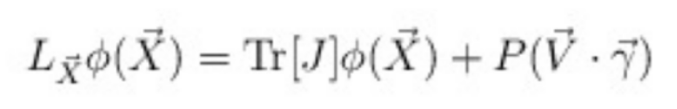
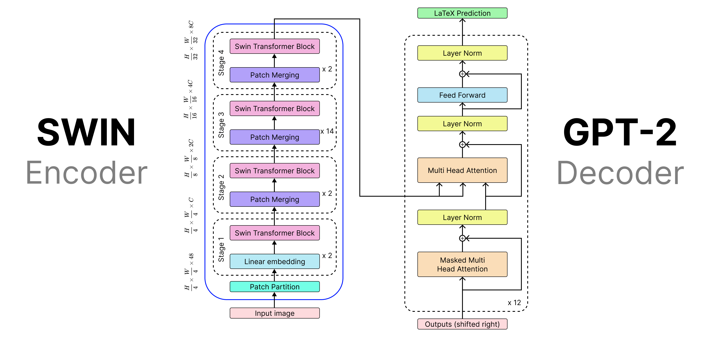

# IPdf2Latex

**IPdf2LaTeX** is a student project aimed at creating in-depth educational resources to help anyone with Python knowledge learn how to develop AI models that convert images into their LaTeX code equivalents.  

We have built a website ([Tutorial IA](https://tutorial-ia-pe.readthedocs.io/)) containing a series of notebooks that cover all the essential concepts you need. This GitHub repository includes those notebooks along with the necessary resources. The notebooks feature detailed explanations, code samples, examples, exercises, and practical implementations to guide you through the learning process.  

# Existing Projects  

Converting an entire PDF or a single mathematical formula into LaTeX code is a well-known and challenging problem. Even the best existing solutions are not perfect. Below is a non-exhaustive list of some of the top projects in this field:  

- **[Mathpix](https://mathpix.com/pdf-to-latex)** – The most advanced tool available, but not open-source.  
- **[Nougat](https://github.com/facebookresearch/nougat)** – Focuses on converting full PDFs.  
- **[Pix2Tex](https://github.com/lukas-blecher/LaTeX-OCR)** – Specializes in recognizing single-line mathematical formulas.  
- **[img2latex](https://github.com/kingyiusuen/image-to-latex)** – Another open-source approach to converting images into LaTeX.  

# Datasets  

The first step in building an AI model for this task is to work with a robust dataset, whether by loading an existing one or creating your own. To help you with this, we have developed four detailed notebooks that cover everything you need to know about datasets:  

- [**`Basics`**](./notebook/datasets/Basics.ipynb) – Introduces fundamental concepts for working with datasets.  
- [**`Images`**](./notebook/datasets/Images.ipynb) – Explains how to handle images in Python and provides useful functions for future projects.  
- [**`Loading`**](./notebook/datasets/Loading.ipynb) – Demonstrates how to load existing datasets from Hugging Face or using `sklearn`.  
- [**`Building`**](./notebook/datasets/Building.ipynb) – Guides you through creating your own dataset consisting of images and text.  

With this foundation, you'll be able to access and manipulate a large collection of images and their latex equivalent like:

    

associated with there equivalent Latex code

\begin{align*} L_{\vec{X}} \phi (\vec{X}) = \mbox{Tr}[J] \phi (\vec{X}) + P (\vec{V} \cdot \vec{\gamma})\end{align*}

# Theory

To make you learn the theory behind those kind of project, we have decided to focus our work on some notebooks which are:
 - [**`Genetic Algorithms`**](./notebook/theory/Genetic_algorithm.ipynb) - Explains for what genetic algorithms are made, what are they, how to use it and provide usable Python class.

# Model

There are various models you can choose from to develop your AI system, but we have decided to fine-tune an Encoder/Decoder model.

Main notebook : [**`Model `**](./notebook/Project/finetuning%20a%20vision%20encoder%20decoder.ipynb)

    
    (Image took from im2latex project)

# Information

Feel free to reach out to us or contribute to our project—see [CONTRIBUTING.md](./CONTRIBUTING.md) for more details!  
